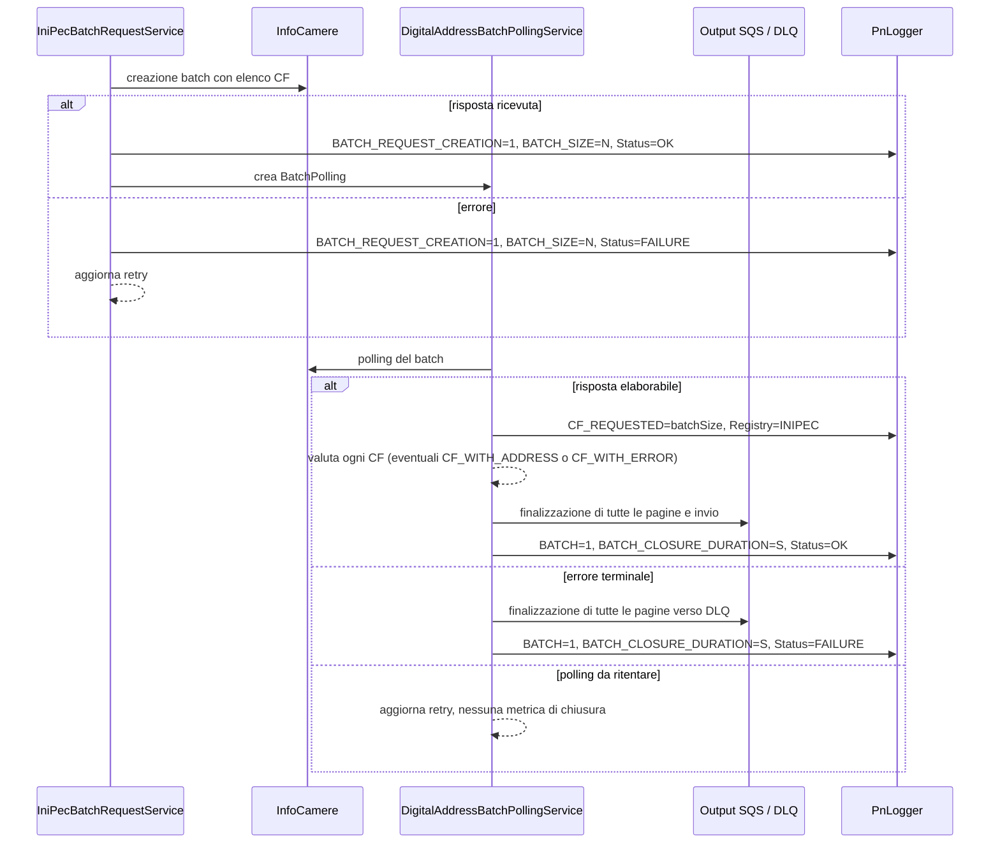

# Metriche applicative

## Ambito

Le metriche custom di `pn-national-registries` monitorano
gli indirizzi trovato dai servizi downstream.

## Modalità di emissione

Le metriche non vengono registrate direttamente tramite l'API Micrometer.
L'applicazione:

1. costruisce uno o più oggetti `GeneralMetric` tramite `MetricUtils`;
2. li passa a `PnLogger#logMetric`, fornito dalla dipendenza `pn-commons`;
3. li scrive nel log strutturato nel formato selezionato da
   `METRIC_FORMAT_TYPE`.

Il template infrastrutturale e l'esempio
`scripts/aws/cfn/microservice-dev-cfg.json` impostano `EMF` (CloudWatch
Embedded Metric Format). In questo formato CloudWatch ricava le metriche
dagli eventi di log, senza una chiamata applicativa a `PutMetricData`. La
configurazione effettiva dell'ambiente osservato va comunque verificata:
`METRIC_FORMAT_TYPE` seleziona il formato del log metrico (ad esempio `EMF` o
`PNF`) e un log descrittivo da solo non garantisce la pubblicazione della
metrica in CloudWatch.

Tutte le metriche custom condividono:

| Proprietà | Valore | Note |
|---|---|---|
| Namespace | `PN-NationalRegistries-Downstream` | Unico per metriche batch e per CF, definito da `MetricUtils` |
| Timestamp | istante di costruzione della metrica, in epoch millisecond | Non coincide necessariamente con l'inizio dell'operazione misurata |
| Numero di valori per oggetto | 1 | Ogni `GeneralMetric` contiene una singola coppia nome/valore |
| Unità | assente, eccetto `Seconds` per `BATCH_CLOSURE_DURATION` | Nessuna unità `Count` impostata esplicitamente |

Le dimensioni non sono uguali per tutte le metriche:

| Nome serializzato | Metriche | Valori effettivi |
|---|---|---|
| `Status` | le quattro metriche batch | `OK`, `FAILURE`; `IN_PROGRESS` esiste nell'enum ma non è emesso |
| `Registry` | `CF_REQUESTED`, `CF_WITH_ADDRESS`, `CF_WITH_ERROR` | `ANPR`, `INAD`, `IPA`, `REGISTRO_IMPRESE`, `INIPEC`, secondo il percorso |
| `NotificationScope` | `CF_WITH_ADDRESS`, `CF_WITH_ERROR` | `PF`, `PG` (se presente nel primo caso) |
| `DigitalAddressScope` | solo `CF_WITH_ADDRESS` | `IMPRESA`, `PROFESSIONISTA`, `PERSONA_FISICA` nei percorsi attuali, se il tipo è riconosciuto |

I nomi sono quelli serializzati da `DimensionName`, non gli identificatori
maiuscoli dell'enum. `DigitalAddressScope` non viene aggiunta per un indirizzo
fisico. `CF_WITH_ADDRESS` aggiunge soltanto le dimensioni non nulle; gli altri
metodi usano le dimensioni indicate nel catalogo.

## Catalogo delle metriche

| Nome | Valore emesso | Dimensioni | Punto di emissione |
|---|---:|---|---|
| `CF_REQUESTED` | `1` per risposta/404 riconosciuto dei percorsi sincroni; `BatchPolling.batchSize` per polling INI-PEC elaborabile | `Registry` | `MetricUtils#logCfRequestedMetric`, `#logInipecCfRequestedMetric` |
| `CF_WITH_ADDRESS` | `1` quando il percorso osservato trova un recapito secondo i propri controlli | `Registry`, `NotificationScope`; `DigitalAddressScope` se digitale e valorizzata | `MetricUtils#logCfWithAddressMetric`, anche da `#logCfWithAddressMetricFromBatchRequest` |
| `CF_WITH_ERROR` | `1` per CF INI-PEC con stato impresa `ER` | `Registry=INIPEC`, `NotificationScope` | `DigitalAddressBatchPollingService#handleERState` |
| `BATCH_REQUEST_CREATION` | `1` per tentativo di creazione batch | `Status` | `IniPecBatchRequestService#execBatchRequest` |
| `BATCH_SIZE` | numero di CF nella richiesta batch | `Status` | Insieme a `BATCH_REQUEST_CREATION` |
| `BATCH` | `1` per finalizzazione di polling completata | `Status` | `DigitalAddressBatchPollingService#updateBatchRequest` |
| `BATCH_CLOSURE_DURATION` | secondi dalla creazione di `BatchPolling` alla fine della finalizzazione | `Status`; unità `Seconds` | Insieme a `BATCH` |

Sono campioni emessi dagli eventi applicativi, non gauge periodiche. Le
metriche per CF non hanno la dimensione `Status`; quelle batch non hanno
`Registry`. Condividere il namespace **non** rende intercambiabili le loro
serie o le rispettive condizioni di emissione.

## Consultazioni sincrone e fallback

`CF_REQUESTED=1` viene emessa con la sola dimensione `Registry` quando il
percorso riceve una risposta (`doOnNext`), anche se non contiene un indirizzo.
ANPR e INAD la emettono anche in alcuni casi di "CF/indirizzo non trovato"
riconosciuti come 404 dai predicati in `GatewayConverter`. Non è un contatore
generale di tentativi né di errori: altri 404, errori tecnici, fallimenti di
validazione precedenti alla risposta e chiamate non strumentate non sono
conteggiati. Per INAD il conteggio precede `emailValidation`: un'email non
valida può generare anche il 404 applicativo riconosciuto e quindi **due**
campioni per la stessa chiamata.

| `Registry` | Dove si emette `CF_REQUESTED` | Quando si emette `CF_WITH_ADDRESS=1` |
|---|---|---|
| `ANPR` | `AnprController#addressANPR` e `PhysicalAddressService` (gateway fisico PF asincrono o sincrono), su risposta o 404 "CF non trovato" riconosciuto | Se il controller riceve una lista di residenze non vuota, oppure se il servizio ricava un `physicalAddress` non nullo; `NotificationScope=PF`, senza `DigitalAddressScope` |
| `REGISTRO_IMPRESE` | `InfoCamereController#addressRegistroImprese` e `PhysicalAddressService` (gateway fisico PG), sulla risposta | Se `professionalAddress`/`physicalAddress` non è nullo; `NotificationScope=PG`, senza `DigitalAddressScope` |
| `INAD` | `DigitalAddressService#callInadForPF` (gateway digitale PF) e `DigitalAddressBatchPollingService#callInadEservice` (fallback PG del batch INI-PEC), su risposta o 404 riconosciuto | Se il recapito convertito è presente: `NotificationScope=PF` sul gateway, `PF`/`PG` nel fallback batch; `DigitalAddressScope` deriva dal tipo restituito (`PERSONA_FISICA`, `PROFESSIONISTA` o `IMPRESA`, se riconosciuto) |
| `IPA` | `DigitalAddressService#retrieveDigitalAddressForPG` (gateway digitale PG), sulla risposta | Se `domicilioDigitale` è un'email valida; `NotificationScope=PG`, `DigitalAddressScope=IMPRESA` |

L'emissione di `CF_WITH_ADDRESS` precede in diversi percorsi l'invio SQS o
l'aggiornamento della `BatchRequest`: non certifica la consegna end-to-end.
Per ANPR e Registro Imprese il criterio nel punto di emissione è la presenza
della lista/dell'oggetto indirizzo, non una metrica separata di validità
temporale o dei singoli campi. Per INAD e IPA sono previste verifiche
dell'email prima del conteggio dell'indirizzo. Una risposta di Registro
Imprese trasformata in DTO senza indirizzo viene comunque conteggiata in
`CF_REQUESTED`.

Il gateway digitale PG ripiega da IPA a INI-PEC quando il domicilio è assente
o non valido; il gateway digitale PF può ripiegare da INAD a INI-PEC in base
alla configurazione. Nel batch INI-PEC un CF PG senza PEC può ripiegare su
INAD. Sono conteggi riferiti al **registro effettivamente consultato**: lo
stesso CF può contribuire a metriche di registri diversi.

Le API private `InadController#digitalAddressINAD` e
`IpaController#ipaPec` invocano direttamente i rispettivi servizi senza
registrare queste metriche. Anche l'endpoint privato di richiesta digitale
INI-PEC accoda una `BatchRequest` senza emettere subito `CF_REQUESTED`; le
metriche del batch sono successive. Le verifiche di Agenzia delle Entrate e
le API InfoCamere di rappresentanza legale non hanno metriche custom in
questo catalogo. `GatewayController` non emette direttamente: le metriche
sono nei servizi chiamati durante l'elaborazione (per il gateway asincrono,
dopo la messa in coda della richiesta).

### Interpretazione dei conteggi per CF

- La somma di `CF_REQUESTED`, per `Registry`, rappresenta i campioni nei
  percorsi indicati, non il totale delle richieste al registro. Per INI-PEC
  somma invece le dimensioni dei batch **arrivati al polling elaborabile**,
  non tutti i CF inviati alla creazione.
- `CF_WITH_ADDRESS` conta i recapiti trovati nei percorsi strumentati: un
  campione per CF/consultazione che raggiunge il punto di emissione, non un
  campione per ciascun indirizzo della risposta.
- Le serie `CF_REQUESTED` e `CF_WITH_ADDRESS` hanno dimensioni diverse; per
  calcolare rapporti occorre selezionare/aggregare esplicitamente le serie
  appropriate. Errori non conteggiati, doppie emissioni, retry e fallback
  impediscono di interpretare il loro rapporto come tasso di successo
  esaustivo di tutte le invocazioni.

## Creazione della richiesta batch

`IniPecBatchRequestService` raccoglie le richieste disponibili, assegna loro un
`batchId` e chiama il servizio InfoCamere che crea il batch INI-PEC.

Alla conclusione della chiamata remota vengono emesse insieme:

- `BATCH_REQUEST_CREATION=1`;
- `BATCH_SIZE=<numero di CF presenti nella richiesta>`.

Il valore di `Status` dipende esclusivamente dall'esito della chiamata
`InfoCamereClient#callEServiceRequestId`:

| Evento | `Status` |
|---|---|
| Il client produce una `IniPecBatchResponse` | `OK` |
| Il client termina con un errore | `FAILURE` |

L'emissione `OK` avviene prima della creazione del record `BatchPolling`.
Pertanto non certifica che il record sia stato persistito né che tutte le
`BatchRequest` siano poi passate allo stato `WORKING`.

In caso di errore, la pipeline aggiorna il contatore di retry e potrà tentare
nuovamente la creazione. Ogni tentativo che raggiunge la chiamata remota genera
un nuovo campione: uno stesso batch logico può quindi contribuire più volte a
`BATCH_REQUEST_CREATION` e `BATCH_SIZE`.

### Interpretazione

- La somma di `BATCH_REQUEST_CREATION`, separata per `Status`, conta i tentativi
  di chiamata per la creazione dei batch, non necessariamente batch persistiti
  con successo.
- La somma di `BATCH_SIZE`, separata per `Status`, conta i codici fiscali
  presentati nei tentativi riusciti o falliti.
- Media, minimo e massimo di `BATCH_SIZE` descrivono la distribuzione della
  dimensione dei batch per singolo tentativo.
- Il rapporto tra la somma con `Status=FAILURE` e la somma complessiva di
  `BATCH_REQUEST_CREATION` misura il tasso di fallimento dei tentativi.

## Codici fiscali nel batch INI-PEC

Quando il polling restituisce una risposta elaborabile,
`DigitalAddressBatchPollingService#handleSuccessfulPolling` emette
`CF_REQUESTED=<BatchPolling.batchSize>` con `Registry=INIPEC`, **prima**
dell'aggiornamento delle `BatchRequest`, se `batchSize` non è nullo. Non
la emette alla creazione del batch, nei polling ancora "in progress" o
per il polling che termina in errore. In caso di fallimento della
finalizzazione dopo questo punto, il campione resta emesso; eventuali
riprocessamenti possono produrne altri.
`BATCH_SIZE` e `CF_REQUESTED` misurano quindi fasi diverse e non vanno
sommate per stimare il numero di CF unici.

Durante l'elaborazione dei singoli CF, `CF_WITH_ADDRESS=1` con
`Registry=INIPEC` viene emessa solo quando una risposta PEC con
`statoImpresa` assente contiene almeno un indirizzo valido dopo il filtro
`removeInvalidEmails`. `NotificationScope` è ricavata dal tipo del
destinatario (`PF`/`PG`); `DigitalAddressScope` deriva dal **primo**
indirizzo conservato (`IMPRESA`/`PROFESSIONISTA`). Le risposte `ND`/`NF`,
senza PEC valida o che attivano il fallback INAD non generano questa
metrica per INI-PEC; un recapito trovato dal fallback genera invece
`CF_WITH_ADDRESS` con `Registry=INAD`.

Se `statoImpresa=ER`, `DigitalAddressBatchPollingService#handleERState`
emette `CF_WITH_ERROR=1` con `Registry=INIPEC` e
`NotificationScope=PF`/`PG`, prima della gestione del retry della singola
richiesta. Non rappresenta tutti gli errori dei CF: ad esempio la
finalizzazione di un batch con errore terminale, l'assenza di PEC e gli
errori del fallback non emettono automaticamente `CF_WITH_ERROR`. I
conteggi delle metriche per singolo CF sono legati alle valutazioni
effettuate, non necessariamente a CF distinti o alla consegna SQS.

## Chiusura del polling

Dopo la creazione del batch, `DigitalAddressBatchPollingService` interroga
InfoCamere fino a ottenere una risposta oppure fino a raggiungere una
condizione terminale di errore. Aggiorna quindi le `BatchRequest`, applica gli
eventuali fallback previsti dal workflow e avvia l'invio verso la coda di
output o la DLQ.

Quando `updateBatchRequest` termina con successo a livello reattivo vengono
emesse insieme:

- `BATCH=1`;
- `BATCH_CLOSURE_DURATION=<durata in secondi>`.

Il valore di `Status` deriva dal parametro con cui è stata avviata la
finalizzazione:

| Stato del polling | `Status` | Significato |
|---|---|---|
| `WORKED` | `OK` | InfoCamere ha restituito una risposta di polling elaborabile |
| `ERROR` | `FAILURE` | Retry ordinari o “in progress” esauriti, oppure errore non ritentabile previsto dal flusso |

`Status=OK` non significa che ogni codice fiscale abbia prodotto una PEC. La
risposta può contenere dati assenti e attivare il fallback verso INAD per
una PG; una singola `BatchRequest` può essere marcata in errore durante
tali passaggi. La dimensione descrive lo stato (`WORKED`/`ERROR`) che ha
avviato la finalizzazione, non l'esito di ogni CF. Sebbene
`StatusDimension` definisca anche `IN_PROGRESS`, nessuna emissione di
`BATCH` o `BATCH_CLOSURE_DURATION` usa quel valore.

L'emissione è nel `doOnSuccess` di `updateBatchRequest`, **dopo** la
finalizzazione ricorsiva di tutte le pagine di `BatchRequest`: una
finalizzazione completata genera una coppia di metriche, non una per
pagina, anche se non vi sono richieste nella pagina iniziale. Per le
pagine non vuote, il flusso aggiorna i record e chiama
`IniPecBatchSqsService#batchSendToSqs` prima dell'emissione. Gli errori
di invio dei singoli messaggi alla coda di output possono essere
assorbiti dal servizio SQS per consentire il recovery: una metrica
`Status=OK` non garantisce la consegna. Un errore propagato prima del
`doOnSuccess` impedisce invece l'emissione della coppia.

### Calcolo della durata

`BATCH_CLOSURE_DURATION` è calcolata come:

```text
(timestamp di emissione - BatchPolling.createdAt) / 1000
```

`BatchPolling.createdAt` viene impostato quando, dopo la risposta positiva alla
creazione del batch remoto, l'applicazione costruisce il record di polling.
La misura comprende quindi attese tra i polling, retry e lavoro di
finalizzazione, inclusi gli eventuali fallback e l'invio SQS eseguito prima
dell'emissione.

Non comprende invece il tempo precedente alla creazione del `BatchPolling`,
come l'attesa iniziale delle richieste, la loro raccolta e la chiamata di
creazione del batch. La divisione è intera: le frazioni di secondo vengono
troncate.

### Interpretazione

- La somma di `BATCH`, separata per `Status`, conta le finalizzazioni che
  hanno raggiunto il punto di emissione, non ogni invocazione HTTP di
  polling.
- Il rapporto tra la somma con `Status=FAILURE` e la somma complessiva di
  `BATCH` misura l'incidenza dei polling chiusi in errore terminale tra quelli
  osservati.
- Media e massimo di `BATCH_CLOSURE_DURATION`, separati per `Status`, mostrano
  rispettivamente latenza tipica e casi più lenti. Eventuali percentili vanno
  calcolati sui campioni della stessa combinazione namespace, metrica e
  dimensione.
- `BATCH_REQUEST_CREATION`, `CF_REQUESTED` con `Registry=INIPEC` e `BATCH`
  descrivono fasi diverse e non devono necessariamente coincidere nella
  stessa finestra temporale: tra le emissioni possono intercorrere più
  cicli di polling e retry.

## Sequenza delle emissioni



La sequenza mostra le emissioni **se** la relativa finalizzazione termina
senza errori propagati; le emissioni per singolo CF avvengono nei soli
rami descritti sopra. Il fallback INAD emette, quando previsto, metriche
con `Registry=INAD`.

## Riferimenti nel codice

| Tema | Riferimento |
|---|---|
| Elenco dei nomi | `model/metrics/MetricName.java` |
| Dimensioni e valori | `model/metrics/DimensionName.java`, `model/metrics/StatusDimension.java`, `model/gateway/GatewayDownstreamService.java`, `constant/RecipientType.java`, `constant/DigitalAddressRecipientType.java` |
| Unità `Seconds` | `model/metrics/MetricUnit.java` |
| Namespace, costruzione dei DTO e chiamata a `logMetric` | `utils/MetricUtils.java` |
| Metriche ANPR e Registro Imprese | `rest/AnprController.java`, `rest/InfoCamereController.java`, `service/PhysicalAddressService.java` |
| Metriche INAD e IPA | `service/DigitalAddressService.java`, `service/DigitalAddressBatchPollingService#callInadEservice` |
| Metriche di creazione batch | `service/IniPecBatchRequestService#execBatchRequest` |
| Metriche dei CF INI-PEC e di chiusura polling | `service/DigitalAddressBatchPollingService#handleSuccessfulPolling`, `#evaluateStatoImpresa`, `#handleERState`, `#updateBatchRequest` |
| Origine di `BatchPolling.createdAt` | `converter/InfoCamereConverter#createBatchPollingByBatchIdAndPollingId` |
| Invio SQS delle pagine prima delle metriche di chiusura | `service/DigitalAddressBatchPollingService#processSinglePage`, `service/IniPecBatchSqsService#batchSendToSqs` |
| Logger custom | `lombok.config`, dipendenza `pn-commons` nel `pom.xml` |
| Formato delle metriche in deploy | parametro `MetricFormatType` e variabile `METRIC_FORMAT_TYPE` in `scripts/aws/cfn/microservice.yml`, esempio `scripts/aws/cfn/microservice-dev-cfg.json` |
