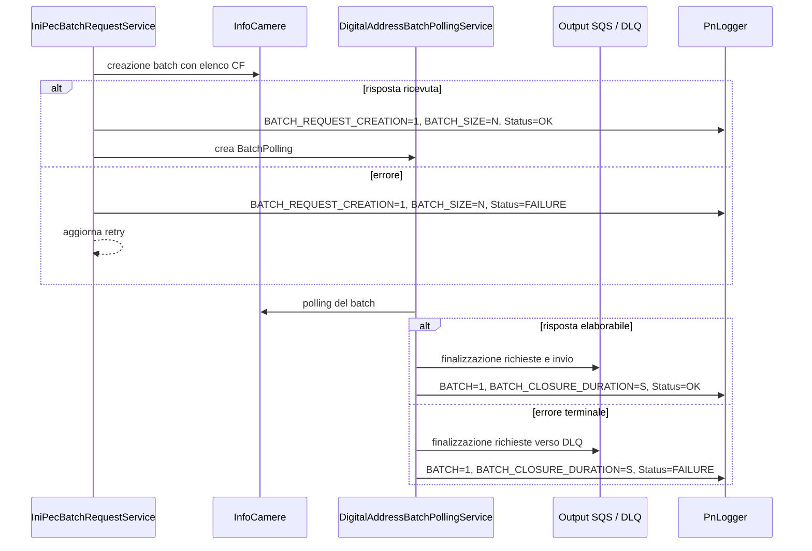

# Metriche applicative

## Ambito

Le metriche custom di `pn-national-registries` riguardano esclusivamente la
pipeline batch di INI-PEC. Nel codice non risultano metriche custom dedicate ad
ANPR, Agenzia delle Entrate, INAD, IPA o agli endpoint del gateway.

L'applicazione espone anche l'endpoint Spring Boot `/actuator/metrics`, ma le
metriche standard di framework disponibili a runtime non rientrano nel
perimetro di questo documento.

## Modalità di emissione

Le metriche non vengono registrate direttamente tramite l'API Micrometer.
L'applicazione:

1. costruisce uno o più oggetti `GeneralMetric` tramite `MetricUtils`;
2. li passa a `PnLogger#logMetric`, fornito dalla dipendenza `pn-commons`;
3. li scrive nel log strutturato nel formato selezionato da
   `METRIC_FORMAT_TYPE`.

Il template infrastrutturale definisce `EMF` (CloudWatch Embedded Metric
Format) come valore predefinito di `METRIC_FORMAT_TYPE`. In questo formato
CloudWatch ricava le metriche direttamente dagli eventi di log, senza una
chiamata applicativa esplicita a `PutMetricData`.

La versione di `pn-commons` usata dal progetto riconosce i formati `EMF` e
`PNF`. Se `METRIC_FORMAT_TYPE` è vuota o contiene un valore diverso, il logger
scrive soltanto il messaggio descrittivo e non aggiunge il payload metrico
strutturato. Il file di configurazione di esempio
`scripts/aws/cfn/microservice-dev-cfg.json` imposta un valore vuoto: il formato
effettivo va quindi verificato nella configurazione dell'ambiente osservato.

Tutte le metriche custom condividono:

| Proprietà | Valore | Note |
|---|---|---|
| Namespace | `national-registries-inipec` | Definito da `MetricUtils` |
| Timestamp | istante di costruzione della metrica, in epoch millisecond | Non coincide necessariamente con l'inizio dell'operazione misurata |
| Dimensione | `Status` | Assume i valori `OK` o `FAILURE` |
| Numero di valori per oggetto | 1 | Ogni `GeneralMetric` contiene una singola coppia nome/valore |

La dimensione non include il `batchId`: questo identificativo compare nel
messaggio e nel contesto del log, ma non crea una serie CloudWatch distinta.

## Catalogo delle metriche

| Nome | Valore emesso | Unità | `Status` | Punto di emissione |
|---|---:|---|---|---|
| `BATCH_REQUEST_CREATION` | `1` | Nessuna | `OK` se la chiamata di creazione batch a InfoCamere restituisce una risposta; `FAILURE` se termina con errore | `IniPecBatchRequestService#logBatchRequestMetrics` |
| `BATCH_SIZE` | numero di codici fiscali inviati nella richiesta batch | Nessuna | Uguale a `BATCH_REQUEST_CREATION` | `IniPecBatchRequestService#logBatchRequestMetrics` |
| `BATCH` | `1` | Nessuna | `OK` quando la finalizzazione parte da un polling `WORKED`; `FAILURE` quando parte da un polling terminale `ERROR` | `DigitalAddressBatchPollingService#logBatchEndingMetrics` |
| `BATCH_CLOSURE_DURATION` | secondi trascorsi dalla creazione del record `BatchPolling` alla fine della sua finalizzazione | `Seconds` | Uguale a `BATCH` | `DigitalAddressBatchPollingService#logBatchEndingMetrics` |

Le quattro metriche sono campioni discreti emessi dagli eventi applicativi:
non sono gauge mantenuti in memoria e non rappresentano uno stato interrogato
periodicamente.

## Creazione della richiesta batch

`IniPecBatchRequestService` raccoglie le richieste disponibili, assegna loro un
`batchId` e chiama il servizio InfoCamere che crea il batch INI-PEC.

Alla conclusione della chiamata remota vengono emesse insieme:

- `BATCH_REQUEST_CREATION=1`;
- `BATCH_SIZE=<numero di CF presenti nella richiesta>`.

Il valore di `Status` dipende esclusivamente dall'esito della chiamata
`InfoCamereClient#callEServiceRequestId`:

| Evento | `Status` |
|---|---|
| Il client produce una `IniPecBatchResponse` | `OK` |
| Il client termina con un errore | `FAILURE` |

L'emissione `OK` avviene prima della creazione del record `BatchPolling`.
Pertanto non certifica che il record sia stato persistito né che tutte le
`BatchRequest` siano poi passate allo stato `WORKING`.

In caso di errore, la pipeline aggiorna il contatore di retry e potrà tentare
nuovamente la creazione. Ogni tentativo che raggiunge la chiamata remota genera
un nuovo campione: uno stesso batch logico può quindi contribuire più volte a
`BATCH_REQUEST_CREATION` e `BATCH_SIZE`.

### Interpretazione

- La somma di `BATCH_REQUEST_CREATION`, separata per `Status`, conta i tentativi
  di chiamata per la creazione dei batch, non necessariamente batch persistiti
  con successo.
- La somma di `BATCH_SIZE`, separata per `Status`, conta i codici fiscali
  presentati nei tentativi riusciti o falliti.
- Media, minimo e massimo di `BATCH_SIZE` descrivono la distribuzione della
  dimensione dei batch per singolo tentativo.
- Il rapporto tra la somma con `Status=FAILURE` e la somma complessiva di
  `BATCH_REQUEST_CREATION` misura il tasso di fallimento dei tentativi.

## Chiusura del polling

Dopo la creazione del batch, `DigitalAddressBatchPollingService` interroga
InfoCamere fino a ottenere una risposta oppure fino a raggiungere una
condizione terminale di errore. Aggiorna quindi le `BatchRequest`, applica gli
eventuali fallback previsti dal workflow e avvia l'invio verso la coda di
output o la DLQ.

Quando questa finalizzazione termina con successo a livello reattivo vengono
emesse insieme:

- `BATCH=1`;
- `BATCH_CLOSURE_DURATION=<durata in secondi>`.

Il valore di `Status` deriva dal parametro con cui è stata avviata la
finalizzazione:

| Stato del polling | `Status` | Significato |
|---|---|---|
| `WORKED` | `OK` | InfoCamere ha restituito una risposta di polling elaborabile |
| `ERROR` | `FAILURE` | Retry ordinari o “in progress” esauriti, oppure errore non ritentabile previsto dal flusso |

`Status=OK` non significa che ogni codice fiscale abbia prodotto una PEC. La
risposta può contenere dati assenti e attivare il fallback verso IPA/INAD;
inoltre una singola `BatchRequest` può essere marcata in errore durante tali
passaggi. La dimensione descrive l'esito terminale del polling INI-PEC usato
per avviare la finalizzazione, non l'esito funzionale di ogni elemento e
neppure una conferma end-to-end della consegna SQS.

L'emissione avviene nel `doOnSuccess` successivo a
`IniPecBatchSqsService#batchSendToSqs`. Nel ramo ordinario, gli errori di invio
dei singoli messaggi alla coda di output vengono assorbiti dal servizio SQS per
consentire il recovery successivo; di conseguenza possono comunque essere
osservate metriche di chiusura con `Status=OK`. Un errore propagato dalla
pipeline prima del `doOnSuccess`, invece, impedisce l'emissione della coppia di
metriche.

### Calcolo della durata

`BATCH_CLOSURE_DURATION` è calcolata come:

```text
(timestamp di emissione - BatchPolling.createdAt) / 1000
```

`BatchPolling.createdAt` viene impostato quando, dopo la risposta positiva alla
creazione del batch remoto, l'applicazione costruisce il record di polling.
La misura comprende quindi attese tra i polling, retry e lavoro di
finalizzazione, inclusi gli eventuali fallback e l'invio SQS eseguito prima
dell'emissione.

Non comprende invece il tempo precedente alla creazione del `BatchPolling`,
come l'attesa iniziale delle richieste, la loro raccolta e la chiamata di
creazione del batch. La divisione è intera: le frazioni di secondo vengono
troncate.

### Interpretazione

- La somma di `BATCH`, separata per `Status`, conta le finalizzazioni di polling
  per cui la pipeline ha raggiunto il punto di emissione.
- Il rapporto tra la somma con `Status=FAILURE` e la somma complessiva di
  `BATCH` misura l'incidenza dei polling chiusi in errore terminale tra quelli
  osservati.
- Media e massimo di `BATCH_CLOSURE_DURATION`, separati per `Status`, mostrano
  rispettivamente latenza tipica e casi più lenti. Eventuali percentili vanno
  calcolati sui campioni della stessa combinazione namespace, metrica e
  dimensione.
- `BATCH_REQUEST_CREATION` e `BATCH` descrivono fasi diverse e non devono
  necessariamente coincidere nella stessa finestra temporale: tra le due
  emissioni possono intercorrere più cicli di polling e retry.

## Sequenza delle emissioni



## Riferimenti nel codice

| Tema | Riferimento |
|---|---|
| Elenco dei nomi | `model/metrics/MetricName.java` |
| Dimensione `Status` | `model/metrics/DimensionName.java`, `model/StatusDimension.java` |
| Unità `Seconds` | `model/metrics/MetricUnit.java` |
| Namespace e costruzione dei DTO | `utils/MetricUtils.java` |
| Metriche di creazione batch | `service/IniPecBatchRequestService#logBatchRequestMetrics` |
| Metriche di chiusura polling | `service/DigitalAddressBatchPollingService#logBatchEndingMetrics` |
| Origine di `BatchPolling.createdAt` | `converter/InfoCamereConverter#createBatchPollingByBatchIdAndPollingId` |
| Invio SQS precedente alle metriche di chiusura | `service/IniPecBatchSqsService#batchSendToSqs` |
| Logger custom | `lombok.config`, dipendenza `pn-commons` nel `pom.xml` |
| Formato delle metriche in deploy | parametro `MetricFormatType` e variabile `METRIC_FORMAT_TYPE` in `scripts/aws/cfn/microservice.yml` |
