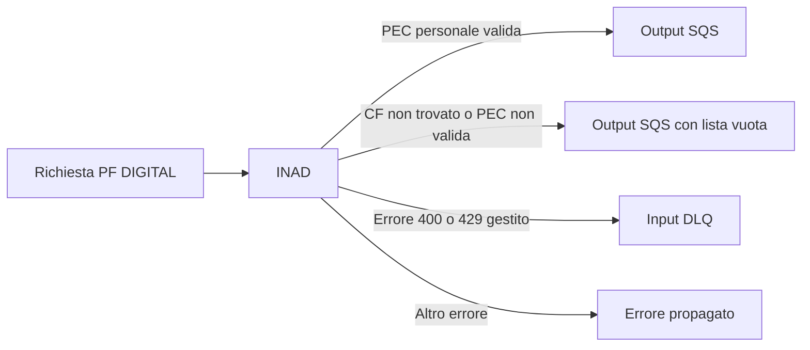
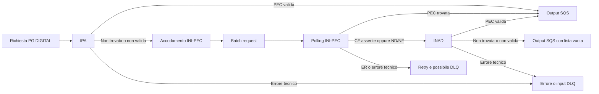
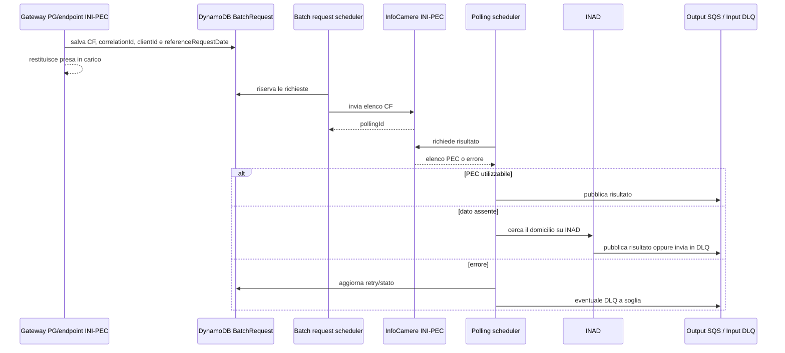

# Ricerca del domicilio digitale (PEC)

## Sintesi

Nel gateway di `pn-national-registries` l'ordine di consultazione dipende dal
tipo di destinatario:

| Destinatario | Workflow |
|---|---|
| PF | INAD |
| PG | IPA -> INI-PEC -> INAD |

Le frecce indicano un fallback funzionale, non un fallback indiscriminato. Il
registro successivo viene interrogato solo in alcuni casi di dato assente o PEC
non valida. In generale, un errore tecnico del registro corrente interrompe la
catena e viene propagato, ritentato oppure inviato in DLQ.

Non esiste una selezione temporale del workflow. `referenceRequestDate` rimane
parte dei contratti e dei messaggi asincroni, ma non determina l'ordine dei
registri consultati.

## Punto di ingresso del gateway

L'endpoint principale è:

```text
POST /national-registries-private/{recipient-type}/addresses
```

Il flusso è asincrono:

1. `GatewayController.getAddresses` invoca
   `GatewayService.retrieveDigitalOrPhysicalAddressAsync`.
2. Il servizio pubblica un `InternalCodeSqsDto` sulla coda di input e risponde
   con il solo `correlationId`.
3. `GatewayInputsHandler` consuma il messaggio e chiama
   `GatewayService.handleMessage`.
4. `GatewayService.retrieveDigitalOrPhysicalAddress` separa PF e PG e poi
   domicilio fisico e digitale.
5. Il risultato della ricerca viene pubblicato sulla coda di output. Per
   INI-PEC questo avviene solo dopo la pipeline batch descritta più avanti.

Di conseguenza, la risposta HTTP positiva del gateway conferma l'accodamento,
non il reperimento della PEC.

I dati principali che governano la richiesta sono:

- `recipientType`: `PF` o `PG`;
- `domicileType`: per questa analisi, `DIGITAL`;
- `taxId`, `correlationId` e `pnNationalRegistriesCxId`: identificano ricerca,
  correlazione e coda del chiamante;
- `referenceRequestDate`: data di riferimento trasportata dal contratto, senza
  effetti sulla scelta del workflow digitale.

Riferimenti principali:

- `GatewayController#getAddresses`;
- `GatewayService#retrieveDigitalOrPhysicalAddressAsync`;
- `GatewayInputsHandler#handle`;
- `GatewayService#retrieveDigitalOrPhysicalAddress`;
- schema `AddressRequestBody` nell'OpenAPI.

## Persona fisica: INAD



Per una PF il gateway consulta soltanto INAD. `InadConverter` seleziona un
domicilio personale, cioè senza `practicedProfession`, tra quelli temporalmente
validi. La PEC viene poi validata sintatticamente.

- PEC valida: viene pubblicata sulla coda di output con recipient
  `PERSONA_FISICA`.
- CF non trovato oppure PEC non valida: viene prodotto un risultato digitale
  con lista vuota.
- Altri errori: non esiste un fallback verso IPA o INI-PEC. Gli errori
  applicativi 400/429 gestiti da `GatewayService.handleException` vengono
  inviati alla input DLQ; gli altri vengono propagati al consumer.

## Persona giuridica: IPA -> INI-PEC -> INAD



Il primo tentativo è IPA:

1. `IpaService` chiama WS23.
2. Se WS23 restituisce più di un elemento, usa il `codAmm` del primo elemento
   per interrogare WS05.
3. Gli specifici 404 generati da zero elementi WS23/WS05 vengono trasformati
   in un `IPAPecDto` vuoto.
4. Il gateway considera utilizzabile IPA solo se la risposta non è
   sostanzialmente vuota e `domicilioDigitale` è una email valida.

Una risposta IPA vuota o con PEC non valida accoda la richiesta INI-PEC. Un
errore tecnico IPA, invece, non attiva INI-PEC.

Se INI-PEC non trova il dato, il polling passa direttamente a INAD tramite
`DigitalAddressBatchPollingService#handlePecNotFoundResponse`.

## Quando scatta un fallback

| Registro corrente | Esito considerato valido | Condizione di fallback | Registro successivo | Errore tecnico |
|---|---|---|---|---|
| IPA per PG | `domicilioDigitale` sintatticamente valido | risposta normalizzata vuota, tutti i campi identificativi null oppure PEC non valida | INI-PEC | nessun fallback; errore/DLQ |
| INI-PEC | record del CF presente e stato impresa non `ND`, `NF` o `ER` | CF non presente nell'elenco oppure stato `ND`/`NF` | INAD | retry; possibile DLQ |
| INAD | PEC selezionata e sintatticamente valida | nessuno: è l'ultimo registro | nessuno | risultato vuoto per "CF non trovato" o PEC non valida; altrimenti errore/DLQ |

### IPA

`IpaService` tratta come assenza dato solo due errori molto specifici:

```text
Service WS23 responded with 0 items - IPA PEC not found
Service WS05 responded with 0 items - IPA PEC not found
```

Questi 404 vengono convertiti in una risposta vuota, consentendo al gateway di
accodare la ricerca INI-PEC. Errori diversi restano errori.

La PEC IPA deve superare `CheckEmailUtils.isValidEmail`. Se non è valida, il
flusso continua con INI-PEC.

### INI-PEC

Dopo il polling, il servizio cerca nell'elenco il `Pec` con codice fiscale
uguale, ignorando maiuscole e minuscole.

- Nessun elemento per il CF: fallback a INAD.
- `statoImpresa = ND` o `NF`: fallback a INAD.
- `statoImpresa = ER`: la richiesta torna nel meccanismo di retry; non viene
  consultato un altro registro.
- `statoImpresa = null`: la risposta viene trattata come risultato da
  pubblicare.

Prima della pubblicazione, `DigitalAddressUtils` elimina gli indirizzi INI-PEC
che non superano la validazione email. Questo controllo avviene dopo la
decisione di fallback: se il record esiste ma contiene soltanto PEC non valide,
il risultato finale ha una lista vuota e non passa a INAD.

Gli errori di creazione batch e polling seguono retry e recovery dedicati. Una
risposta transitoria `List PEC in progress` usa il contatore
`inProgressRetry`; gli altri errori usano il contatore ordinario. Il
superamento delle soglie, o un errore bad request nei punti previsti, porta
alla DLQ invece che al registro successivo.

### INAD

INAD è l'unico registro per le PF ed è l'ultimo registro per le PG. La scelta
della PEC avviene nel converter:

- PF: prima PEC personale temporalmente valida;
- PG con tax ID lungo 11 caratteri e un solo indirizzo senza professione:
  quell'indirizzo;
- negli altri casi PG: prima PEC professionale.

Dopo la selezione, la PEC passa dalla validazione sintattica dell'email. Il caso
"CF non trovato", compresa la PEC selezionata ma non valida, viene convertito
in un output con `digitalAddress: []`. Gli altri errori non innescano ulteriori
fallback.

## Pipeline asincrona INI-PEC

INI-PEC non viene interrogato in linea con la richiesta del gateway.



Passaggi applicativi:

1. `InfoCamereService#getIniPecDigitalAddress` salva una `BatchRequest` con
   stato `NOT_WORKED` e `batchId = NO_BATCH_ID`.
2. `IniPecBatchRequestService#batchPecRequest` raggruppa le richieste, invia
   l'elenco dei CF a InfoCamere e crea un `BatchPolling`.
3. `DigitalAddressBatchPollingService#batchPecPolling` recupera il risultato,
   associa ogni `Pec` al CF richiesto e decide risultato, retry o fallback
   diretto a INAD.
4. `IniPecBatchSqsService#batchSendToSqs` pubblica i risultati `WORKED` sulla
   coda di output; per gli elementi `ERROR` effettua il redrive sulla input
   DLQ.

La `BatchRequest` conserva la `referenceRequestDate` per mantenere i dati della
richiesta originaria nei passaggi asincroni e negli eventuali redrive. La data
non modifica il workflow.

## Endpoint diretti

Oltre al gateway esistono endpoint dedicati ai singoli registri.

| Endpoint | Comportamento |
|---|---|
| `POST /national-registries-private/ipa/pec` | Chiama solo IPA. Lo specifico "zero items" viene restituito come DTO vuoto; non chiama INI-PEC o INAD. |
| `POST /national-registries-private/{recipient-type}/inad/digital-address` | Chiama solo INAD e applica la selezione personale per PF o professionale per PG. Non applica la validazione email aggiuntiva di `GatewayConverter#emailValidation`. |
| `POST /national-registries-private/inipec/digital-address` | Salva una richiesta batch e risponde con la correlazione. Durante il polling, un esito non trovato passa direttamente a INAD. |

Il termine "endpoint diretto" non implica isolamento completo per INI-PEC:
l'endpoint avvia la stessa elaborazione batch usata dal gateway PG e il
fallback avviene successivamente.

## Casi limite e incongruenze rilevanti

### Il tipo destinatario non è salvato nel batch

`BatchRequest` non contiene `recipientType`. Quando il fallback arriva a INAD,
`InadConverter.retrieveRecipientType` lo ricostruisce dalla lunghezza del
codice fiscale:

```text
lunghezza 16 -> PF
altra lunghezza -> PG
```

La decisione può divergere dal tipo logico del soggetto che ha originato la
richiesta, in particolare per chiamate dirette a INI-PEC.

### Il redrive INI-PEC usa PG

`IniPecBatchSqsService` costruisce i messaggi di DLQ con
`recipientType = "PG"` e `domicileType = "DIGITAL"`. Questo è coerente con il
gateway, dove soltanto le PG entrano nella pipeline INI-PEC, ma è un vincolo da
considerare per le richieste inviate all'endpoint INI-PEC diretto.

### PEC INI-PEC non valida senza fallback

Per IPA e INAD una PEC non valida partecipa alla decisione "non trovato". Per
INI-PEC, invece, le email non valide vengono rimosse solo durante la costruzione
dell'output. Se il record era presente e non aveva stato `ND`/`NF`, non viene
consultato INAD.

### Errori durante il batch INI-PEC

Un errore tecnico di creazione o polling del batch non attiva INAD. La
richiesta segue i contatori di retry e, quando previsto, viene inviata alla
DLQ. Il fallback a INAD è riservato agli esiti di dato assente riconosciuti.

## Mappa dei riferimenti nel codice

| Tema | Implementazione |
|---|---|
| Ingresso e scelta PF/PG | `GatewayService#retrieveDigitalOrPhysicalAddress`, `#retrieveAddressForPF`, `#retrieveAddressForPG` |
| Workflow digitale PF | `GatewayService#retrieveAddressForPF` |
| Workflow digitale PG | `GatewayService#retrieveDigitalAddress` |
| Fallback dopo INI-PEC | `DigitalAddressBatchPollingService#handlePecNotFoundResponse` |
| Esito INAD nel batch | `DigitalAddressBatchPollingService#callInadEservice`, `GatewayConverter#emailValidation` |
| Interpretazione polling INI-PEC | `DigitalAddressBatchPollingService#evaluateInipecResponse`, `#evaluateStatoImpresa` |
| Pulizia email INI-PEC | `DigitalAddressUtils#updateBatchRequestFields`, `#removeInvalidEmails` |
| Selezione PEC INAD | `InadConverter#mapToResponseOk`, `#mapToPfAddress`, `#mapToPgAddress` |
| Normalizzazione "not found" IPA | `IpaService#getIpaPec`, `#checkNumItemsResultDto` |
| Batch e polling | `IniPecBatchRequestService`, `DigitalAddressBatchPollingService` |
| Output e DLQ batch | `IniPecBatchSqsService#batchSendToSqs`, `#execBatchSendToSqs` |
| Contratti HTTP | `../openapi/PNT2Y-OpenAPI3_PN-NationalRegistries.yaml` |

I test che rendono espliciti i rami principali sono soprattutto:

- `GatewayServiceTest`: PF su INAD e PG con IPA oppure fallback a INI-PEC;
- `DigitalAddressBatchPollingServiceTest`: fallback INI-PEC -> INAD, stati
  `ND`/`NF`/`ER` ed errori INAD;
- `InadServiceTest` e `InadConverterTest`: selezione della PEC personale o
  professionale in base al tipo destinatario;
- `IpaServiceTest`: WS23/WS05 e normalizzazione dello "zero items".

## Conclusione

Il comportamento da tenere presente è:

```text
PF    INAD
PG    IPA -> INI-PEC -> INAD
```

Un "non trovato" riconosciuto normalmente fa avanzare il flusso PG o chiude la
ricerca con una lista vuota; un errore tecnico normalmente non fa avanzare al
registro successivo. La maggiore complessità resta nella pipeline asincrona
INI-PEC, dove stato impresa, validazione tardiva delle email, retry e
ricostruzione del tipo destinatario possono modificare l'esito osservabile.
