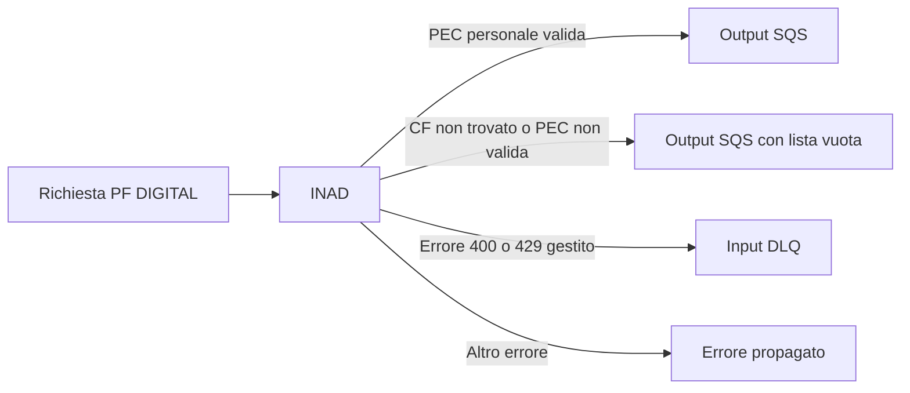
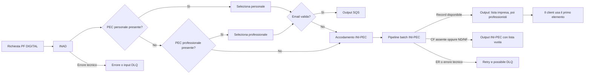
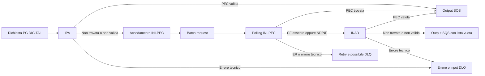
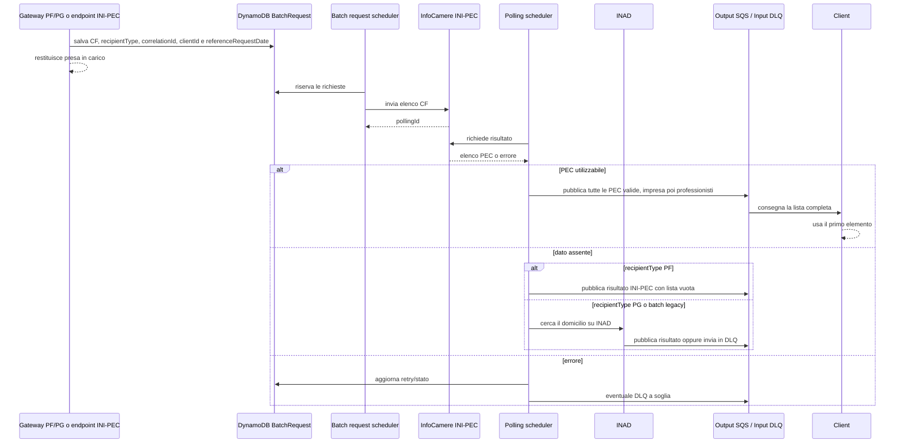

# Ricerca del domicilio digitale (PEC)

## Sintesi

Nel gateway di `pn-national-registries` l'ordine di consultazione dipende dal
tipo di destinatario e, per le persone fisiche, dal feature flag
`pn.national.registries.enable-pf-pec-fallback-flow`:

| Destinatario | Configurazione | Workflow |
|---|---|---|
| PF | flag disattivo | INAD personale |
| PF | flag attivo | INAD personale -> INAD professionale -> INI-PEC |
| PG | non applicabile | IPA -> INI-PEC -> INAD |

Per una PF, i passaggi INAD personale e INAD professionale non corrispondono a
due chiamate: il converter esamina in quest'ordine gli indirizzi temporalmente
validi della stessa risposta INAD. Analogamente, INI-PEC viene interrogato una
sola volta e può restituire una lista contenente prima la PEC dell'impresa e
poi le PEC del professionista. `pn-national-registries` pubblica tutti gli
indirizzi validi; è il client a usare sempre il primo elemento della lista.
L'ordine determina quindi una priorità effettiva dell'impresa individuale
rispetto al professionista, pur senza interrogazioni INI-PEC distinte.

Le frecce indicano un fallback funzionale, non un fallback indiscriminato. Il
registro successivo viene interrogato solo in alcuni casi di dato assente o PEC
non valida. In generale, un errore tecnico del registro corrente interrompe la
catena e viene propagato, ritentato oppure inviato in DLQ.

Nella pipeline batch INI-PEC, l'esito dato assente dipende dal tipo destinatario
salvato nella richiesta. Per PF, CF assente oppure stato `ND`/`NF` chiudono il
workflow con una lista vuota; per PG attivano il fallback a INAD. In questo modo
il flusso PF non richiama il registro già consultato.

Non esiste una selezione temporale del workflow. `referenceRequestDate` rimane
parte dei contratti e dei messaggi asincroni, ma non determina l'ordine dei
registri consultati.

Il flag è esposto da `NationalRegistriesConfig` e il valore di default è
`false`. Il file di configurazione CloudFormation per l'ambiente development
lo valorizza a `true`; il valore effettivo dipende dall'ambiente.

## Punto di ingresso del gateway

L'endpoint principale è:

```text
POST /national-registries-private/{recipient-type}/addresses
```

Il flusso è asincrono:

1. `GatewayController.getAddresses` invoca
   `GatewayService.retrieveDigitalOrPhysicalAddressAsync`.
2. Il servizio pubblica un `InternalCodeSqsDto` sulla coda di input e risponde
   con il solo `correlationId`.
3. `GatewayInputsHandler` consuma il messaggio e chiama
   `GatewayService.handleMessage`.
4. `GatewayService.retrieveDigitalOrPhysicalAddress` separa PF e PG e poi
   domicilio fisico e digitale.
5. Il risultato della ricerca viene pubblicato sulla coda di output. Per
   INI-PEC questo avviene solo dopo la pipeline batch descritta più avanti.

Di conseguenza, la risposta HTTP positiva del gateway conferma l'accodamento,
non il reperimento della PEC.

I dati principali che governano la richiesta sono:

- `recipientType`: `PF` o `PG`;
- `domicileType`: per questa analisi, `DIGITAL`;
- `taxId`, `correlationId` e `pnNationalRegistriesCxId`: identificano ricerca,
  correlazione e coda del chiamante;
- `referenceRequestDate`: data di riferimento trasportata dal contratto, senza
  effetti sulla scelta del workflow digitale.

Riferimenti principali:

- `GatewayController#getAddresses`;
- `GatewayService#retrieveDigitalOrPhysicalAddressAsync`;
- `GatewayInputsHandler#handle`;
- `GatewayService#retrieveDigitalOrPhysicalAddress`;
- schema `AddressRequestBody` nell'OpenAPI.

## Persona fisica

### Flag disattivo: solo INAD personale



Con il flag disattivo il gateway consulta soltanto INAD. `InadConverter`
seleziona un domicilio personale, cioè senza `practicedProfession`, tra quelli
temporalmente validi. La PEC viene poi validata sintatticamente.

- PEC valida: viene pubblicata sulla coda di output con recipient
  `PERSONA_FISICA`.
- CF non trovato oppure PEC non valida: viene prodotto un risultato digitale
  con lista vuota.
- Altri errori: non esiste un fallback verso IPA o INI-PEC. Gli errori
  applicativi 400/429 gestiti da
  `GatewayService#handleExceptionAndSendToDlq` vengono
  inviati alla input DLQ; gli altri vengono propagati al consumer.

### Flag attivo: INAD personale/professionale -> INI-PEC



Con il flag attivo `GatewayService#getDigitalAddressForPF` delega a
`DigitalAddressService#retrieveDigitalAddressForPFFromInadWithIniPecFallback`.
La prima chiamata resta INAD, ma `InadConverter#mapToPfAddress` cambia la
selezione:

1. cerca il primo domicilio personale temporalmente valido;
2. solo se non lo trova, cerca il primo domicilio professionale temporalmente
   valido;
3. se non trova nessuno dei due, genera il not found usato per attivare
   INI-PEC.

Anche quando viene selezionato un domicilio professionale, il messaggio SQS
prodotto da questo ramo mantiene recipient `PERSONA_FISICA`, perché il tipo
passato da `DigitalAddressService` al converter dipende dal destinatario della
richiesta e non da `practicedProfession`.

La validazione sintattica dell'email avviene dopo questa selezione, in
`DigitalAddressUtils#emailValidation`. Di conseguenza, se INAD restituisce una
PEC personale non valida e anche una professionale valida, il converter sceglie
la personale, la validazione fallisce e il gateway passa direttamente a
INI-PEC: non torna al converter per provare la professionale.

Il fallback a INI-PEC scatta nei seguenti casi:

- risposta INAD senza domicilio selezionabile;
- not found INAD riconosciuto da `GatewayConverter#errorInadToSqsDto`;
- PEC selezionata da INAD ma sintatticamente non valida.

Un errore INAD diverso dal not found riconosciuto non viene trasformato in
fallback. Gli errori 400/429 previsti dal gateway vengono inviati alla input
DLQ; gli altri vengono propagati.

INI-PEC è asincrono. Se produce un record utilizzabile, l'output può contenere
più indirizzi: prima `pecImpresa` con recipient `IMPRESA`, poi tutti gli
elementi di `pecProfessionista` con recipient `PROFESSIONISTA`. Le email non
valide vengono rimosse, ma le email valide non vengono ridotte a un solo
risultato. Il client riceve l'intera lista e ne usa il primo elemento; per
questo l'ordine costruito dal converter realizza la priorità impresa
individuale, poi professionista.

Se INI-PEC non contiene il CF oppure restituisce stato `ND`/`NF`, il polling
legge `recipientType = PF` dalla `BatchRequest` e pubblica un risultato INI-PEC
con `digitalAddress: []`. Non viene eseguita una seconda chiamata INAD.

## Persona giuridica: IPA -> INI-PEC -> INAD



Il primo tentativo è IPA:

1. `IpaService` chiama WS23.
2. Se WS23 restituisce più di un elemento, usa il `codAmm` del primo elemento
   per interrogare WS05.
3. Gli specifici 404 generati da zero elementi WS23/WS05 vengono trasformati
   in un `IPAPecDto` vuoto.
4. Il gateway considera utilizzabile IPA solo se la risposta non è
   sostanzialmente vuota e `domicilioDigitale` è una email valida.

Una risposta IPA vuota o con PEC non valida accoda la richiesta INI-PEC. Un
errore tecnico IPA, invece, non attiva INI-PEC.

Se INI-PEC non trova il dato, il polling passa direttamente a INAD tramite
`DigitalAddressBatchPollingService#handlePecNotFoundResponse`.

## Quando scatta un fallback

| Registro corrente | Esito considerato valido | Condizione di fallback | Registro successivo | Errore tecnico |
|---|---|---|---|---|
| INAD iniziale per PF, flag disattivo | prima PEC personale temporalmente e sintatticamente valida | nessuna: assenza o PEC non valida chiudono con lista vuota | nessuno | nessun fallback; errore/DLQ |
| INAD iniziale per PF, flag attivo | prima PEC personale oppure, se assente, prima PEC professionale; email sintatticamente valida | nessun domicilio selezionabile, not found riconosciuto oppure PEC selezionata non valida | INI-PEC | nessun fallback; errore/DLQ |
| IPA per PG | `domicilioDigitale` sintatticamente valido | risposta normalizzata vuota, tutti i campi identificativi null oppure PEC non valida | INI-PEC | nessun fallback; errore/DLQ |
| INI-PEC per PF | record del CF presente e stato impresa non `ND`, `NF` o `ER`; pubblicazione di tutte le PEC valide | nessuna: CF assente o stato `ND`/`NF` chiudono con lista vuota | nessuno | retry; possibile DLQ |
| INI-PEC per PG | record del CF presente e stato impresa non `ND`, `NF` o `ER`; pubblicazione di tutte le PEC valide | CF non presente nell'elenco oppure stato `ND`/`NF` | INAD | retry; possibile DLQ |
| INAD dopo INI-PEC per PG | PEC selezionata e sintatticamente valida | nessuno: è l'ultimo registro | nessuno | risultato vuoto per "CF non trovato" o PEC non valida; altrimenti errore/DLQ |

### IPA

`IpaService` tratta come assenza dato solo due errori molto specifici:

```text
Service WS23 responded with 0 items - IPA PEC not found
Service WS05 responded with 0 items - IPA PEC not found
```

Questi 404 vengono convertiti in una risposta vuota, consentendo al gateway di
accodare la ricerca INI-PEC. Errori diversi restano errori.

La PEC IPA deve superare `DigitalAddressUtils.isValidEmail`. Se non è valida, il
flusso continua con INI-PEC.

### INI-PEC

Dopo il polling, il servizio cerca nell'elenco il `Pec` con codice fiscale
uguale, ignorando maiuscole e minuscole.

- Nessun elemento per il CF: output INI-PEC vuoto per PF, fallback a INAD per
  PG.
- `statoImpresa = ND` o `NF`: output INI-PEC vuoto per PF, fallback a INAD per
  PG.
- `statoImpresa = ER`: la richiesta torna nel meccanismo di retry; non viene
  consultato un altro registro.
- `statoImpresa = null`: la risposta viene trattata come risultato da
  pubblicare.

Per un record da pubblicare, `InfoCamereConverter#convertToDigitalAddress`
costruisce una lista con questo ordine:

1. `pecImpresa`, se valorizzata, con recipient `IMPRESA`;
2. tutti gli elementi `pecProfessionista`, con recipient `PROFESSIONISTA`.

Prima della pubblicazione, `DigitalAddressUtils` elimina gli indirizzi INI-PEC
che non superano la validazione email. Questo controllo avviene dopo la
decisione di fallback: se il record esiste ma contiene soltanto PEC non valide,
il risultato finale ha una lista vuota e non passa a INAD.

Tutti gli indirizzi rimasti vengono inviati al client. Il servizio non sceglie
un solo domicilio INI-PEC: è il client che usa il primo elemento e attribuisce
quindi rilevanza funzionale all'ordine impresa-professionisti.

Gli errori di creazione batch e polling seguono retry e recovery dedicati. Una
risposta transitoria `List PEC in progress` usa il contatore
`inProgressRetry`; gli altri errori usano il contatore ordinario. Il
superamento delle soglie, o un errore bad request nei punti previsti, porta
alla DLQ invece che al registro successivo.

### INAD

INAD è l'unico registro consultato per le PF con flag disattivo e il primo
registro per le PF con flag attivo. Non viene richiamato dopo INI-PEC per le
nuove richieste PF. Per le PG è il registro finale. La scelta della PEC avviene
nel converter:

- PF con flag disattivo: prima PEC personale temporalmente valida;
- PF con flag attivo: prima PEC personale temporalmente valida oppure, solo se
  assente, prima PEC professionale temporalmente valida;
- PG con tax ID lungo 11 caratteri e un solo indirizzo senza professione:
  quell'indirizzo;
- negli altri casi PG: prima PEC professionale.

Dopo la selezione, nel gateway e nel fallback batch PG la PEC passa dalla
validazione sintattica dell'email. Nel passaggio PF con flag attivo, il caso
"CF non trovato", compresa la PEC selezionata ma non valida, attiva INI-PEC.
Con flag disattivo o nel passaggio INAD finale delle PG, lo stesso caso viene
convertito in un output con `digitalAddress: []`. Gli altri errori non
innescano ulteriori fallback.

## Pipeline asincrona INI-PEC

INI-PEC non viene interrogato in linea con la richiesta del gateway.



Passaggi applicativi:

1. `InfoCamereService#getIniPecDigitalAddress` salva una `BatchRequest` con
   stato `NOT_WORKED`, `batchId = NO_BATCH_ID` e `recipientType`.
2. `IniPecBatchRequestService#batchPecRequest` raggruppa le richieste, invia
   l'elenco dei CF a InfoCamere e crea un `BatchPolling`.
3. `DigitalAddressBatchPollingService#batchPecPolling` recupera il risultato,
   associa ogni `Pec` al CF richiesto e decide risultato, retry oppure fallback
   a INAD per PG e batch legacy privi di `recipientType`.
4. `InfoCamereConverter` costruisce l'elenco completo degli indirizzi,
   anteponendo la PEC impresa alle PEC professionista, e rimuove quelli non
   validi.
5. `IniPecBatchSqsService#batchSendToSqs` pubblica i risultati `WORKED` sulla
   coda di output; per gli elementi `ERROR` effettua il redrive sulla input
   DLQ.

La `BatchRequest` conserva la `referenceRequestDate` per mantenere i dati della
richiesta originaria nei passaggi asincroni e negli eventuali redrive. La data
non modifica il workflow. Conserva anche il `recipientType`: il gateway passa
esplicitamente `PF` o `PG`, mentre l'endpoint INI-PEC diretto lo ricava dalla
lunghezza del CF. Nella pipeline di polling,
`GatewayUtils#retrieveRecipientType` usa la lunghezza soltanto per i batch
legacy in cui l'attributo non è presente.

## Endpoint diretti

Oltre al gateway esistono endpoint dedicati ai singoli registri.

| Endpoint | Comportamento |
|---|---|
| `POST /national-registries-private/ipa/pec` | Chiama solo IPA. Lo specifico "zero items" viene restituito come DTO vuoto; non chiama INI-PEC o INAD. |
| `POST /national-registries-private/{recipient-type}/inad/digital-address` | Chiama solo INAD. Per PF seleziona solo la PEC personale con flag disattivo, oppure personale e poi professionale con flag attivo; per PG applica la selezione dedicata. Non applica la validazione aggiuntiva di `DigitalAddressUtils#emailValidation` e non attiva INI-PEC. |
| `POST /national-registries-private/inipec/digital-address` | Ricava il tipo dalla lunghezza del CF, lo salva nella richiesta batch e risponde con la correlazione. Pubblica l'intera lista ordinata di PEC valide; con tipo inferito PF un not found chiude con lista vuota, mentre con tipo inferito PG passa a INAD. |

Il termine "endpoint diretto" non implica isolamento completo per INI-PEC:
l'endpoint avvia la stessa elaborazione batch usata dai gateway PF e PG e il
fallback a INAD avviene successivamente soltanto per un tipo inferito PG. Il
feature flag influenza anche l'endpoint INAD diretto perché è letto da
`InadService`, ma il controller INAD non concatena altri registri.

## Casi limite e incongruenze rilevanti

### Tipo destinatario e batch legacy

Le nuove `BatchRequest` contengono `recipientType`. I workflow gateway
persistono il tipo dichiarato dalla richiesta; l'endpoint INI-PEC diretto, che
non lo riceve nel contratto, lo ricava dalla lunghezza del codice fiscale:

```text
lunghezza 16 -> PF
altra lunghezza -> PG
```

Per compatibilità, `GatewayUtils#retrieveRecipientType` mantiene la stessa
inferenza quando legge una batch request legacy senza il nuovo attributo. In
`handlePecNotFoundResponse`, però, un valore null non è riconosciuto come PF e
attiva ancora la chiamata INAD: una richiesta PF creata prima del fix può
quindi conservare temporaneamente il vecchio percorso duplicato.

### Il redrive INI-PEC usa PG

`IniPecBatchSqsService` costruisce i messaggi di DLQ con
`recipientType = "PG"` e `domicileType = "DIGITAL"`. Con il nuovo workflow
questo non riguarda più soltanto le PG: anche una richiesta PF con flag attivo
può entrare nella pipeline e, in caso di redrive, essere ricostruita come PG.
Il servizio non usa ancora il nuovo `BatchRequest.recipientType` per questa
operazione.

### Ordine INI-PEC e scelta del client

`pn-national-registries` non sceglie una sola PEC INI-PEC. Dopo la rimozione
degli indirizzi non validi, pubblica l'intera lista con la PEC impresa prima
delle PEC professionista. Il client usa sempre il primo elemento: la priorità
impresa individuale -> professionista è quindi il risultato congiunto
dell'ordinamento nel converter e della selezione client-side.

### PEC personale INAD non valida

Con flag attivo il fallback professionale INAD avviene soltanto se la PEC
personale è assente. Se la personale esiste ma non è sintatticamente valida,
la validazione successiva alla selezione porta a INI-PEC senza provare
l'eventuale PEC professionale presente nella stessa risposta.

### PEC INI-PEC non valida senza fallback

Per IPA e INAD una PEC non valida partecipa alla decisione "non trovato". Per
INI-PEC, invece, le email non valide vengono rimosse solo durante la costruzione
dell'output. Se il record era presente e non aveva stato `ND`/`NF`, non viene
consultato INAD. Se tutte le PEC vengono eliminate, il client riceve una lista
vuota.

### Il not found INI-PEC dipende dal tipo destinatario

Quando il CF non è presente o lo stato è `ND`/`NF`, una richiesta PF viene
chiusa con un output INI-PEC vuoto e non richiama INAD. Il fallback INAD resta
attivo per le PG e per le batch request legacy senza `recipientType`.

### Errori durante il batch INI-PEC

Un errore tecnico di creazione o polling del batch non attiva INAD. La
richiesta segue i contatori di retry e, quando previsto, viene inviata alla
DLQ. Il fallback a INAD è riservato agli esiti di dato assente riconosciuti
delle PG o dei batch legacy privi di tipo.

## Mappa dei riferimenti nel codice

| Tema | Implementazione |
|---|---|
| Ingresso e scelta PF/PG | `GatewayService#retrieveDigitalOrPhysicalAddress`, `#retrieveAddressForPF`, `#retrieveAddressForPG` |
| Feature flag PF | `NationalRegistriesConfig#enablePfPecFallbackFlow`, `GatewayService#getDigitalAddressForPF` |
| Workflow digitale PF | `DigitalAddressService#retrieveDigitalAddressFromInadForPF`, `#retrieveDigitalAddressForPFFromInadWithIniPecFallback` |
| Workflow digitale PG | `DigitalAddressService#retrieveDigitalAddressForPG` |
| Tipo destinatario nel batch | `BatchRequest#recipientType`, `InfoCamereService#createBatchRequestByCf`, `GatewayUtils#retrieveRecipientType` |
| Esito not found INI-PEC | `DigitalAddressBatchPollingService#handlePecNotFoundResponse` |
| Fallback INAD nel batch PG | `DigitalAddressBatchPollingService#callInadEservice`, `DigitalAddressUtils#emailValidation` |
| Interpretazione polling INI-PEC | `DigitalAddressBatchPollingService#evaluateInipecResponse`, `#evaluateStatoImpresa` |
| Composizione lista INI-PEC | `InfoCamereConverter#convertResponsePecToCodeSqsDto`, `#convertToDigitalAddress` |
| Pulizia email INI-PEC | `InfoCamereConverter#populateBatchRequestSendFields`, `DigitalAddressUtils#removeInvalidEmails` |
| Selezione PEC INAD | `InadConverter#mapToResponseOk`, `#mapToPfAddress`, `#mapToPgAddress` |
| Normalizzazione "not found" IPA | `IpaService#getIpaPec`, `#checkNumItemsResultDto` |
| Batch e polling | `IniPecBatchRequestService`, `DigitalAddressBatchPollingService` |
| Output e DLQ batch | `IniPecBatchSqsService#batchSendToSqs`, `#execBatchSendToSqs` |
| Contratti HTTP | `../openapi/PNT2Y-OpenAPI3_PN-NationalRegistries.yaml` |

I test che rendono espliciti i rami principali sono soprattutto:

- `GatewayServiceTest`: scelta del workflow PF in base al flag e workflow PG;
- `DigitalAddressServiceTest`: output INAD PF, fallback a INI-PEC per risposta
  vuota/404 e propagazione degli altri errori;
- `DigitalAddressBatchPollingServiceTest`: fallback INI-PEC -> INAD, stati
  `ND`/`NF`/`ER` ed errori INAD per il percorso PG;
- `InadServiceTest` e `InadConverterTest`: preferenza personale e fallback
  professionale per PF in base al flag;
- `InfoCamereConverterTest` e `DigitalAddressUtilsTest`: composizione
  dell'output INI-PEC e rimozione delle email non valide;
- `GatewayUtilsTest`: precedenza del tipo persistito e inferenza dal CF per i
  record che ne sono privi;
- `IpaServiceTest`: WS23/WS05 e normalizzazione dello "zero items".

## Conclusione

Il comportamento da tenere presente è:

```text
PF, flag disattivo    INAD personale
PF, flag attivo       INAD personale/professionale -> INI-PEC
PG                    IPA -> INI-PEC -> INAD
```

Un "non trovato" riconosciuto fa avanzare il flusso configurato oppure, nel
passaggio terminale, chiude la ricerca con una lista vuota; un errore tecnico
normalmente non fa avanzare al registro successivo. INI-PEC pubblica tutte le
PEC valide nell'ordine impresa-professionisti e il client usa il primo
elemento. La maggiore complessità resta nella pipeline asincrona, dove stato
impresa, tipo destinatario persistito, compatibilità dei batch legacy,
validazione tardiva delle email e retry possono modificare l'esito osservabile.
