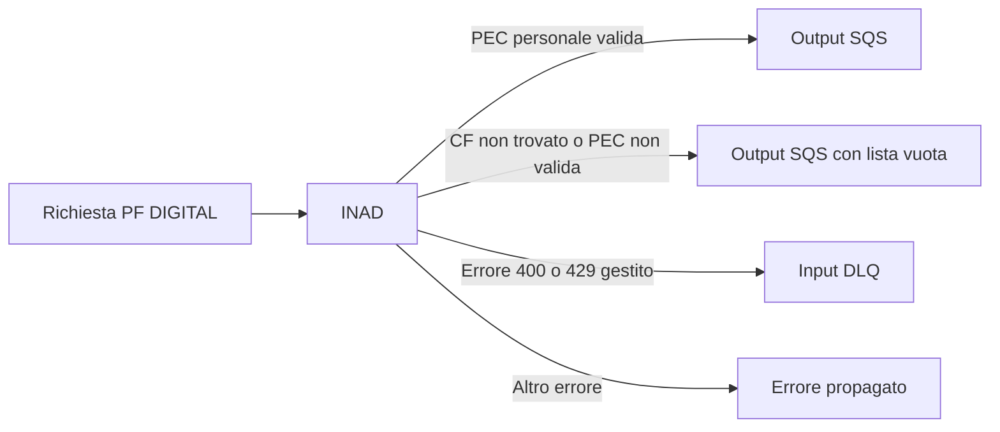
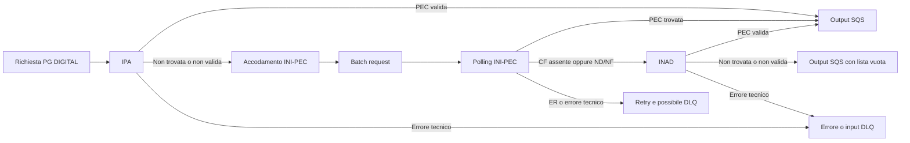
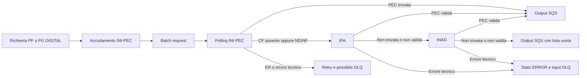
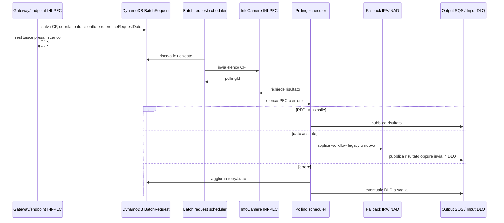

# Ricerca del domicilio digitale (PEC)

## Sintesi

Nel gateway di `pn-national-registries` l'ordine di consultazione non è unico:
dipende dal tipo di destinatario e dalla data di riferimento della richiesta.

| Destinatario | Workflow legacy | Nuovo workflow |
|---|---|---|
| PF | INAD | INI-PEC -> IPA -> INAD |
| PG | IPA -> INI-PEC -> INAD | INI-PEC -> IPA -> INAD |

Le frecce indicano un fallback funzionale, non un fallback indiscriminato. Il
registro successivo viene interrogato solo in alcuni casi di dato assente o PEC
non valida. In generale, un errore tecnico del registro corrente interrompe la
catena e viene propagato, ritentato oppure inviato in DLQ.

Il nuovo workflow viene selezionato quando `referenceRequestDate` è compresa,
estremi inclusi, tra `pfNewWorkflowStart` e `pfNewWorkflowStop`. Nonostante il
nome `pfNewWorkflow`, in `GatewayService` la stessa condizione viene applicata
sia alle PF sia alle PG.

Non è possibile stabilire dal solo repository quale workflow sia attivo in un
ambiente: le date sono parametri di deploy. I valori presenti nei file locali o
di esempio non descrivono necessariamente la configurazione runtime.

## Punto di ingresso del gateway

L'endpoint principale è:

```text
POST /national-registries-private/{recipient-type}/addresses
```

Il flusso è asincrono:

1. `GatewayController.getAddresses` invoca
   `GatewayService.retrieveDigitalOrPhysicalAddressAsync`.
2. Il servizio pubblica un `InternalCodeSqsDto` sulla coda di input e risponde
   con il solo `correlationId`.
3. `GatewayInputsHandler` consuma il messaggio e chiama
   `GatewayService.handleMessage`.
4. `GatewayService.retrieveDigitalOrPhysicalAddress` separa PF e PG e poi
   domicilio fisico e digitale.
5. Il risultato della ricerca viene pubblicato sulla coda di output. Per
   INI-PEC questo avviene solo dopo la pipeline batch descritta più avanti.

Di conseguenza, la risposta HTTP positiva del gateway conferma l'accodamento,
non il reperimento della PEC.

I dati che governano il flusso sono:

- `recipientType`: `PF` o `PG`;
- `domicileType`: per questa analisi, `DIGITAL`;
- `referenceRequestDate`: decide tra workflow legacy e nuovo;
- `taxId`, `correlationId` e `pnNationalRegistriesCxId`: identificano ricerca,
  correlazione e coda del chiamante.

Riferimenti principali:

- `GatewayController#getAddresses`;
- `GatewayService#retrieveDigitalOrPhysicalAddressAsync`;
- `GatewayInputsHandler#handle`;
- `GatewayService#retrieveDigitalOrPhysicalAddress`;
- schema `AddressRequestBody` nell'OpenAPI.

## Selezione temporale del workflow

`FeatureEnabledUtils.isPfNewWorkflowEnabled`:

1. legge `pfNewWorkflowStart` e `pfNewWorkflowStop` da
   `NationalRegistriesConfig`;
2. converte entrambi i valori in `Instant`;
3. restituisce `true` se la data della richiesta è `>= start` e `<= stop`.

La decisione viene presa:

- nel gateway, prima di iniziare la ricerca digitale;
- dopo un esito INI-PEC non trovato, usando la data salvata nella
  `BatchRequest`;
- dentro `InadService`, per scegliere quale tipo di domicilio INAD privilegiare.

Per l'endpoint INI-PEC diretto la data salvata è l'istante corrente. Per
l'endpoint INAD diretto, invece, viene passata una data nulla e la selezione
interna di INAD resta sempre quella legacy.

Riferimenti:

- `FeatureEnabledUtils#isPfNewWorkflowEnabled`;
- `NationalRegistriesConfig`;
- `GatewayService#retrieveAddressForPF`;
- `GatewayService#retrieveAddressForPG`;
- `DigitalAddressBatchPollingService#handlePecNotFoundResponse`;
- `InadService#callEService`.

## Workflow legacy

### Persona fisica: INAD



Per una PF il workflow legacy consulta soltanto INAD. Il converter seleziona un
domicilio personale, cioè senza `practicedProfession`. La PEC viene poi
validata sintatticamente.

- PEC valida: viene pubblicata sulla coda di output con recipient
  `PERSONA_FISICA`.
- CF non trovato oppure PEC non valida: viene prodotto un risultato digitale
  con lista vuota.
- Altri errori: non esiste un fallback verso IPA o INI-PEC. Gli errori
  applicativi 400/429 gestiti da `GatewayService.handleException` vengono
  inviati alla input DLQ; gli altri vengono propagati al consumer.

### Persona giuridica: IPA -> INI-PEC -> INAD



Il primo tentativo è IPA:

1. `IpaService` chiama WS23.
2. Se WS23 restituisce più di un elemento, usa il `codAmm` del primo elemento
   per interrogare WS05.
3. Gli specifici 404 generati da zero elementi WS23/WS05 vengono trasformati
   in un `IPAPecDto` vuoto.
4. Il gateway considera utilizzabile IPA solo se la risposta non è
   sostanzialmente vuota e `domicilioDigitale` è una email valida.

Una risposta IPA vuota o con PEC non valida accoda la richiesta INI-PEC. Un
errore tecnico IPA, invece, non attiva INI-PEC.

Se INI-PEC non trova il dato, il workflow legacy passa direttamente a INAD.
Questo comportamento è implementato da
`DigitalAddressBatchPollingService#oldWorkFlow`.

## Nuovo workflow: INI-PEC -> IPA -> INAD

Il nuovo ordine è uguale per PF e PG:



Il gateway non contatta subito un registro remoto: crea una `BatchRequest`
INI-PEC. Solo al termine del polling, se il dato non è presente, viene eseguito
`newWorkFlow`, che chiama IPA e poi eventualmente INAD.

Le differenze rispetto al legacy sono quindi:

- PF: da solo INAD a INI-PEC -> IPA -> INAD;
- PG: IPA e INI-PEC scambiano priorità;
- per una PF, quando si arriva a INAD, `InadConverter` preferisce una PEC
  professionale e usa quella personale solo se la professionale non esiste.

## Quando scatta realmente un fallback

| Registro corrente | Esito considerato valido | Condizione di fallback | Registro successivo | Errore tecnico |
|---|---|---|---|---|
| IPA nel legacy PG | `domicilioDigitale` sintatticamente valido | risposta normalizzata vuota, tutti i campi identificativi null oppure PEC non valida | INI-PEC | nessun fallback; errore/DLQ |
| INI-PEC nel legacy | record del CF presente e stato impresa non `ND`, `NF` o `ER` | CF non presente nell'elenco oppure stato `ND`/`NF` | INAD | retry; possibile DLQ |
| INI-PEC nel nuovo workflow | come sopra | CF non presente nell'elenco oppure stato `ND`/`NF` | IPA | retry; possibile DLQ |
| IPA nel nuovo workflow | `domicilioDigitale` sintatticamente valido | risposta vuota o PEC non valida | INAD | stato `ERROR`; nessun fallback a INAD |
| INAD | PEC selezionata e sintatticamente valida | nessuno: è l'ultimo registro | nessuno | risultato vuoto per “CF non trovato” o PEC non valida; altrimenti errore/DLQ |

### IPA

`IpaService` tratta come assenza dato solo due errori molto specifici:

```text
Service WS23 responded with 0 items - IPA PEC not found
Service WS05 responded with 0 items - IPA PEC not found
```

Questi 404 vengono convertiti in una risposta vuota, consentendo al chiamante
di applicare il fallback. Errori diversi restano errori.

Sia nel gateway legacy sia nel batch del nuovo workflow la PEC IPA deve
superare `CheckEmailUtils.isValidEmail`. Se non è valida, il flusso continua
con il registro successivo.

### INI-PEC

Dopo il polling, il servizio cerca nell'elenco il `Pec` con codice fiscale
uguale, ignorando maiuscole e minuscole.

- Nessun elemento per il CF: fallback.
- `statoImpresa = ND` o `NF`: fallback.
- `statoImpresa = ER`: la richiesta torna nel meccanismo di retry; non viene
  consultato un altro registro.
- `statoImpresa = null`: la risposta viene trattata come risultato da
  pubblicare.

Prima della pubblicazione, `DigitalAddressUtils` elimina gli indirizzi
INI-PEC che non superano la validazione email. Questo controllo avviene però
dopo la decisione di fallback: se il record esiste ma contiene soltanto PEC non
valide, il risultato finale ha una lista vuota e non passa a IPA o INAD.

Gli errori di creazione batch e polling seguono retry e recovery dedicati. Una
risposta transitoria `List PEC in progress` usa il contatore
`inProgressRetry`; gli altri errori usano il contatore ordinario. Il
superamento delle soglie, o un errore bad request nei punti previsti, porta
alla DLQ invece che al registro successivo.

### INAD

INAD è sempre l'ultimo registro di una catena. La scelta della PEC avviene nel
converter:

- PF legacy: prima PEC personale valida temporalmente;
- PF nuovo workflow: prima PEC professionale, altrimenti personale;
- PG con tax ID lungo 11 caratteri e un solo indirizzo senza professione:
  quell'indirizzo;
- negli altri casi PG: prima PEC professionale.

Dopo la selezione, anche INAD passa dalla validazione sintattica dell'email.
Il caso “CF non trovato”, compresa la PEC selezionata ma non valida, viene
convertito in un output con `digitalAddress: []`. Gli altri errori non
innescano ulteriori fallback.

## Pipeline asincrona INI-PEC

INI-PEC non viene interrogato in linea con la richiesta del gateway.



Passaggi applicativi:

1. `InfoCamereService#getIniPecDigitalAddress` salva una `BatchRequest` con
   stato `NOT_WORKED` e `batchId = NO_BATCH_ID`.
2. `IniPecBatchRequestService#batchPecRequest` raggruppa le richieste, invia
   l'elenco dei CF a InfoCamere e crea un `BatchPolling`.
3. `DigitalAddressBatchPollingService#batchPecPolling` recupera il risultato,
   associa ogni `Pec` al CF richiesto e decide risultato, retry o fallback.
4. `IniPecBatchSqsService#batchSendToSqs` pubblica i risultati `WORKED` sulla
   coda di output; per gli elementi `ERROR` effettua il redrive sulla input
   DLQ.

La `BatchRequest` conserva la `referenceRequestDate`, ma non conserva il
`recipientType` originario.

## Endpoint diretti

Oltre al gateway esistono endpoint dedicati ai singoli registri.

| Endpoint | Comportamento |
|---|---|
| `POST /national-registries-private/ipa/pec` | Chiama solo IPA. Lo specifico “zero items” viene restituito come DTO vuoto; non chiama INI-PEC o INAD. |
| `POST /national-registries-private/{recipient-type}/inad/digital-address` | Chiama solo INAD. Passa `referenceRequestDate = null`, quindi usa sempre la selezione INAD legacy. Non applica la validazione email aggiuntiva di `GatewayConverter#emailValidation`. |
| `POST /national-registries-private/inipec/digital-address` | Salva una richiesta batch e risponde con la correlazione. Usa la data corrente; durante il polling un “non trovato” può quindi attivare il fallback legacy o nuovo configurato per quella data. |

Il termine “endpoint diretto” non implica dunque isolamento completo per
INI-PEC: l'endpoint avvia la stessa elaborazione batch usata dal gateway, e il
fallback avviene successivamente.

## Casi limite e incongruenze rilevanti

### Il tipo destinatario si perde nel batch

`BatchRequest` non contiene `recipientType`. Quando il fallback arriva a INAD,
`InadConverter.retrieveRecipientType` lo ricostruisce dalla lunghezza del
codice fiscale:

```text
lunghezza 16 -> PF
altra lunghezza -> PG
```

La decisione può quindi divergere dal `recipientType` ricevuto dal gateway.

### Il redrive INI-PEC usa sempre PG

`IniPecBatchSqsService` costruisce i messaggi di DLQ con
`recipientType = "PG"` e `domicileType = "DIGITAL"`. Poiché nel nuovo workflow
anche le PF iniziano da INI-PEC, una richiesta PF che entra nel ramo di errore
batch può essere rimessa in coda come PG.

### PEC INI-PEC non valida senza fallback

Per IPA e INAD una PEC non valida partecipa alla decisione “non trovato”. Per
INI-PEC, invece, le email non valide vengono rimosse solo durante la
costruzione dell'output. Se il record era presente e non aveva stato `ND`/`NF`,
non viene consultato il registro successivo.

### Errore IPA nel batch

Nel nuovo workflow, se IPA fallisce con un errore invece di restituire un
risultato vuoto, `callIpaEservice` imposta la richiesta in `ERROR` e termina il
ramo. INAD viene chiamato solo quando IPA risponde senza una PEC valida.

### Metadati del flusso non sempre coerenti

L'enum `EService` descrive staticamente `INIPEC -> IPA -> INAD`, ma
`oldWorkFlow` passa da INI-PEC direttamente a INAD. Il log di quel metodo usa
comunque `INIPEC.getNextStep()` e può quindi indicare IPA anche se il codice sta
per chiamare INAD. Per ricostruire il legacy va seguito il metodo, non il
metadato dell'enum.

### Classificazione del risultato

`GatewayConverter#ipaToSqsDto` classifica sempre la PEC IPA come `IMPRESA`.
Nel fallback INAD batch la classificazione dipende invece dal tipo ricostruito:
`PERSONA_FISICA` per PF e `IMPRESA` per PG, anche quando la PEC scelta per una
PF nel nuovo workflow è una PEC professionale.

### Errore durante l'accodamento INI-PEC

Nel nuovo workflow, se il salvataggio iniziale della `BatchRequest` fallisce,
`GatewayService#retrieveDigitalAddress` invia la richiesta alla input DLQ e
restituisce comunque l'acknowledgement con il `correlationId`. Non prova IPA o
INAD in linea.

## Mappa dei riferimenti nel codice

| Tema | Implementazione |
|---|---|
| Ingresso e scelta PF/PG | `GatewayService#retrieveDigitalOrPhysicalAddress`, `#retrieveAddressForPF`, `#retrieveAddressForPG` |
| Workflow legacy PG | `GatewayService#retrieveOldDigitalAddress` |
| Avvio nuovo workflow | `GatewayService#retrieveDigitalAddress` |
| Fallback dopo INI-PEC | `DigitalAddressBatchPollingService#handlePecNotFoundResponse`, `#oldWorkFlow`, `#newWorkFlow` |
| IPA -> INAD | `DigitalAddressBatchPollingService#callIpaEservice` |
| Esito INAD | `DigitalAddressBatchPollingService#callInadEservice`, `GatewayConverter#emailValidation` |
| Interpretazione polling INI-PEC | `DigitalAddressBatchPollingService#evaluateInipecResponse`, `#evaluateStatoImpresa` |
| Pulizia email INI-PEC | `DigitalAddressUtils#updateBatchRequestFields`, `#removeInvalidEmails` |
| Selezione PEC INAD | `InadConverter#mapToResponseOk`, `#mapToPfAddress`, `#mapToPgAddress` |
| Normalizzazione “not found” IPA | `IpaService#getIpaPec`, `#checkNumItemsResultDto` |
| Finestra del nuovo workflow | `FeatureEnabledUtils#isPfNewWorkflowEnabled`, `NationalRegistriesConfig` |
| Batch e polling | `IniPecBatchRequestService`, `DigitalAddressBatchPollingService` |
| Output e DLQ batch | `IniPecBatchSqsService#batchSendToSqs`, `#execBatchSendToSqs` |
| Contratti HTTP | `../openapi/PNT2Y-OpenAPI3_PN-NationalRegistries.yaml` |

I test che rendono espliciti i rami principali sono soprattutto:

- `GatewayServiceTest`: PF legacy su INAD, nuovo workflow su INI-PEC e PG
  legacy con fallback IPA -> INI-PEC;
- `DigitalAddressBatchPollingServiceTest`: fallback INI-PEC -> IPA,
  IPA -> INAD, stati `ND`/`NF`/`ER` ed errori INAD;
- `InadServiceTest`: priorità personale/professionale nei due workflow;
- `IpaServiceTest`: WS23/WS05 e normalizzazione dello “zero items”.

## Conclusione

I fallback esistono, ma sono condizionati al tipo di assenza dato riconosciuto
dal singolo registro. Il comportamento centrale da tenere presente è:

```text
legacy PF      INAD
legacy PG      IPA -> INI-PEC -> INAD
nuovo PF/PG    INI-PEC -> IPA -> INAD
```

Un “non trovato” riconosciuto normalmente fa avanzare o chiude il flusso con
una lista vuota; un errore tecnico normalmente non fa avanzare al registro
successivo. La maggiore complessità è concentrata nel passaggio asincrono
INI-PEC, dove data di riferimento, stato impresa, validazione tardiva delle
email, retry e perdita del tipo destinatario possono modificare l'esito
osservabile.
